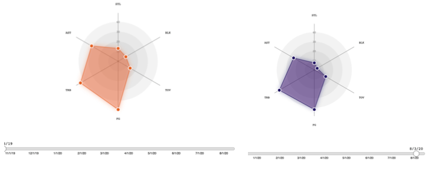
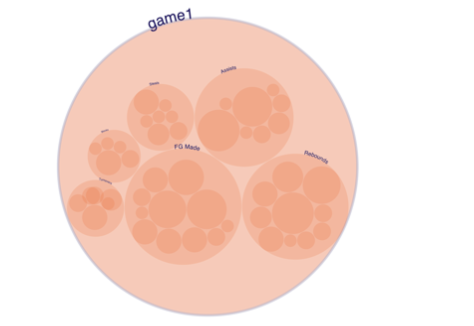
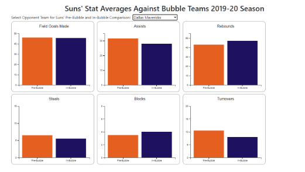

# Too Hot for the Bubble?
# Overview:
 
The Phoenix Suns had a spectacular bubble run in the 2019-20 NBA season when they should have never been invited and everyone doubted them. A cursory glance of the Suns’ regular season before COVID-19 lockdowns began shows that our boys were some of the lowest in the league. Since joining the bubble, The Phoenix Suns had blown away not only residents of the State of Arizona, but the rest of the nation. The Valley boys had outperformed and beaten the West Coast’s best teams, but barely missed playoff qualifications. We will be taking a look into the season where the Phoenix Suns became the NBA’s darlings and analyze their success at the NBA Bubble in Orlando. 

## Data description:

All three visualization techniques will use the following six statistics/variables: 
- Field Goals Made (FGM, FG)
- Assists (AST)
- Total Rebounds (TRB)
- Steals (STL)
- Blocks (BLK)
- Turnovers (TOV)

The datasets are in the form of a table with the attributes of each revolving around the mentioned statistics/variables. All items from the radar chart and circle packing chart’s dataset are the total number of games from the Suns’ 2019-20 season and the bar graph’s dataset is the averages of Suns’ performances from 1) before the bubble and 2) during the bubble.

Data Source: https://www.basketball-reference.com/teams/PHO/2020_games.html

For the radar chart, the initial dataset was preprocessed in order to calculate a running average of the six measured statistics (field goals made, assists, rebounds, steals, blocks, and turnovers) across the season. Each game shows the “personality” of the team, and how effectively the team as a whole performed. To perform these calculations the csv was modified in Microsoft Excel and yielded a secondary csv file to be used for charting.

For the bar graphs, from visualization 2’s dataset, we hand-calculated the averages of field goals made, assists, rebounds, steals, blocks, and turnovers from Suns’ games against bubble opponents before and during the bubble which were provided by the data source and we put the averages in a .csv file for easy handling.

For the circle packing chart, the data was retrieved and pre-processed in python. Using the python scraping library Selenium, box scores for all 72 games were scraped from the url above. Then, for each game, every active player’s field goals made, rebounds, assists, blocks, turnovers, and steals were extracted and put into a json file. Each game had its own json file due to the hierarchical structure requirements of the circle packing chart. This processed data can be found in the viz3 folder within the data folder on GitHub.

## Goals and Tasks:
**Domain**:
The target user base for our dashboard will be Phoenix Suns fans, but other, more general user bases that may be interested would include NBA-wide fans, NBA “stat freaks”, NBA coaches, and Sport News outlets in Phoenix. To get a sense of the size of the Phoenix Suns fanbase, across major social media platforms, the Phoenix Suns have 1,000 Discord members, 27,000 Youtube subscribers, 90,800 subreddit members, 1,100,000 Twitter followers, 1.6 million Instagram followers, and 1.8 Facebook likes.

**Tasks**:
- In the first visualization, the Suns’ performance during the pre-bubble and in-bubble will be visualized with a running average so that users will be able to find trends in the Suns’ play-style throughout the 2019-2020 season.
- In the second visualization, match-ups with teams from both pre-bubble and in-bubble will be presented as bar charts so users can compare how the Suns performed pre-bubble and in-bubble and find trends within those games.
- In the third visualization, the Suns’ players contribution for each game will be presented to users and users will be able to identify which player(s) stood out during any given game during the 2019-2020 season.

## Idioms: 
Visualization idioms are a unique sequence of data enrichment and enhancement transformations. Idioms can include visualization mappings and the process of rendering transformations that produce an abstract display of a data set. 

Our interface **tells a story** about the transition from The Phoenix Suns of Old to the Newly Reformed Phoenix Suns. A story-based interface, our project presents the user in chronological order of how the Suns began their season, the bumps caused by Coronavirus along the way, and the end product -- a perfect 8-0 record in the 2020 Orlando Bubble. By comparing previous performances against the Suns themselves and their opponents and understanding how each play contributed to six key statistics, we were able to reach a conclusion told throughout the visualization: the Suns’ potential grew within the bubble in an unprecedented fashion.

(Radar Chart) Visualization 1 allows the user to scroll though the dates of every pre-bubble and in-bubble game to see how the Suns’ team personality modulated throughout the season. With animations between each date chosen on the slider beneath the chart, users can visually see how the Suns’ personality is pretty fluid, changing across opponents and time of year.
Encoding choices and design decisions: To show the fluctuation of the team’s statistics across the regular season, users can click to drag the date slider across the calendar year. To highlight the separation of the bubble games from the regular season games, the two “eras” were given different colors. Users can view the exact (round to nearest tenth decimal) value of each of the six statistics by hovering over the plot point on the respective statistic’s axis. 

 

(Bubble Chart) Visualization 3 showcases each active player’s contributions on 5 levels: field goals made, steals, rebounds, blocks, and turnovers. The user is able to select and view a breakdown for each season game (pre-bubble and in-bubble) by using a game slider. 

(Bar Chart) Visualization 2 compares how the Suns’ did stat-wise before the bubble and during the bubble against the seven match-ups from the bubble to see if there were any improvements in performance and we would base our concluding arguments based off the bar charts.
Since this visualization supports user interaction, users will be able to select which of the seven match-ups they would like to compare Suns’ pre-bubble and in-bubble performances.

**Linking**: Since our project was a store-telling interface, our visualizations were not visually linked. Although the visualizations were based on the core dataset, we found more value in telling the story behind the Suns’ reformation and that required separating our visualizations.

**Algorithms**: Visualizations 1 and 2 did not require any algorithms. However, visualization 3 required a size coding algorithm as the technique consists of concentric bubbles that are proportionally sized to statistical contribution (Munzner, p. 204-205). We will also use a form of the ​circular packing algorithm​ to place the player contribution circles within the game total circles (references to this in d3 can be found ​here​ and ​here​).
## Reflection:

From the project proposal, we initially envisioned having a visual analytics interface but after receiving some feedback, we changed our project to reflect an interactive data-driven story as it would be a way we can display the entirety of the Suns’ 2019-20 season through a narrative and visualizations. While the original proposal was realistic and achievable, it did not quite link visualizations together effectively. As we found it difficult to find an effective way of linking our visualizations together, we settled on an interactive data-driven story. As for getting to the final product, nothing changed in the plan since the WIP so we were all able to slowly get everything together for the final product.

One unexpected challenge rose during the box score data pre-processing for visualization 3. While extracting XPATHs to use when scraping data from the url above, there was some uniformity lacking in XPATHs across pages (games). There were also several empty cells (for players not playing or table headers) which also threw several errors while running the data scraper. This led to much more time spent on data scraping than expected. To avoid this in the future, data sources will be inspected ahead of time to validate that their HTML semantics are uniform and will not require excessive time on pre-processing. 

Next time, we would probably like to try and add more customizable visualizations. This would enable the user to interact with multiple visualizations however they see fit and draw analysis about the Suns’ performance for themselves. If more time is permitted, we could also add the stats from other teams that the Suns’ went against to see how better/worse they performed against the Suns before the bubble and during the bubble.

## Team workload: 

**Anay Gupta**: 
- Completed scraping of box scores for all 72 Suns games.
- Completed pre-processing of box score datasets.
- Developed and styled circle packing chart (viz #3) containing the six major stats mentioned above. 

**Mani Kandan**: 
- Completed pre-processing data for dataset 1 from all Suns’ games.
- Developed and styled radar chart (viz #2) for the six statistics.
- Added slider for user to filter by date of game played.
- Helped script story-telling narrative.

**Khang Le**: 
- Completed pre-processing data for dataset 2 from all the Suns’ bubble opponent games before and during the bubble.
- Developed the bar charts for visualization 2.
- Helped design and programmed index.html for the entire narrative