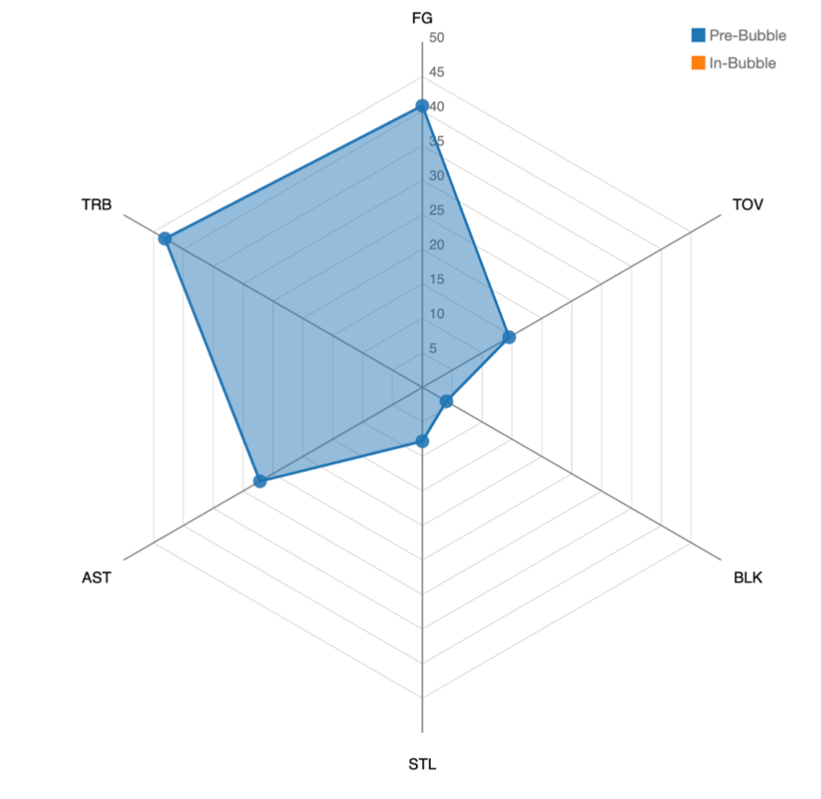

# Bubble-Stats-494
#Tasks Completed: 
##Pre-Processing:
Viz #1 (Completed): Imported game log dataset and calculated stat averages for pre-bubble and in-bubble Suns.

Viz #2 (Completed): Created a .csv file that shows calculated Suns’ stat averages against the 7 teams from the bubble and before the bubble.

##Viz #1 Tasks:
Create View 1 of Radar Chart for Pre-bubble
Tested various scales for best scaling values, and order of statistics around the border of radar charts. 
Legend added
Styling (default colors used for now)

##Viz #2 Tasks: 
Used data from Basketball Reference to compute Suns’ game stats against a specific team and separated the data by Regular season to Bubble.
Created a new .csv file and stored the data 

##Viz #3 Tasks:
Successfully directed web scraper to box score XPATHS (elements) for 2019-2020 Phoenix Suns games found in original data source.
Automated scraping & pre-processing of box scores still underway for concentric bubble chart. 

#Tasks Left:
##Pre-Processing:
Viz #3 (In-Progress): 
Finish scraping box scores and clean data for concentric bubble chart.

##Viz #1 Tasks:
Coordinate layers of radar chart and appropriately change scalings.
Styling (still in progress, default colors used)

##Viz #2 Tasks: 
Create Bar charts for all 6 stats
Create drop-down inputs for the 7 teams
Add legend and tooltip for bars

##Viz #3 Tasks:
Create bubble views
Create user-inputs and hover-on tooltip
Style visualization 

#Project Changes

We will be changing from our “semi-interactive” interface to a data-driven story per Dr. Bryan’s suggestion.

The order and grouping of visualizations shown will change mildly. This is the story we’d like to paint:
Viz 1 (radar chart) and Viz 3 (player contribution per game innovative chart) will be shown simultaneously for only pre-bubble games.
Users can scroll back and forth through a timeline of pre-bubble ONLY games.
This ensures a change is made to all visible charts per each scroll from the user.
All values across Viz 1 and Viz 3 charts will be cumulative averages, instead of an overall average. Instead of using overall average, which would stay constant and not “trigger a change” in every single click/hover/lasso/selection, we will be using a cumulative average that progresses through all games (pre-bubble only, in-bubble only, and all games).

Once the user reaches the end of the pre-bubble games, there will be a transition with some information, and a new view will update for the user. This new view will include in-bubble stats and Viz 2 (bar chart comparison of teams played in-bubble vs. pre-bubble)
Viz 1 (radar chart) and Viz 3 (player contribution per game innovative bubble chart) will be shown simultaneously. These 2 charts will begin with values left from the last pre-bubble game before the NBA created the bubble and finish with the last in-bubble game.
Users can scroll back and forth through a timeline of in-bubble ONLY games.
This ensures a change is made to all visible charts per each scroll from the user.
Cumulative averages will be used in Viz 1 and Viz 3.
Finally, once all games have been scrolled through, the user will be shown Viz 2. This visualization will be the basis of our conclusion for the story. Our team will come up with reasonings for why the Suns played so effectively in-bubble.

#Screenshot of Basic Radar Chart (Viz #1)

Link to original data source: https://www.basketball-reference.com/teams/PHO/2020_games.html 
